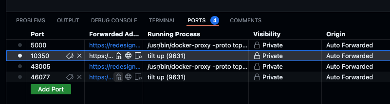

# Solana AI Agent Demo based on ElizaOS

An opinionated, batteries-included, ElizaOS distribution designed for ease of development and secure, scalable deployments.

## Overview

This AI Agent provides a stable environment for deploying AI agents at scale, both within Trustless Engineering Co. and for customers' on-premises deployments.


## Key Features
- Simplified ElizaOS setup
- Isolated structure to allow custom plugins/agents
- Helm chart for deployment into any kubernetes environment
- Dev Container support

## Prerequisites

> **Note**: The default/recommended setup requires at least 16GB RAM.

### Development Environment Options

## Getting Started

### 1. Initialize Environment
```bash
make init
```

### 2. Configure API Keys
Required configuration:
- `OPENAI_API_KEY` - Get yours [here](https://platform.openai.com/docs/overview)
- `OPENROUTER_API_KEY` (Recommended) - Get yours at [OpenRouter.ai](https://openrouter.ai/)

Add to your `.env` file:
```env
OPENAI_API_KEY=sk-...
OPENROUTER_API_KEY=sk-or-....
```

### 3. Launch Development Environment
1. Run `tilt up` in the root directory
2. Access the environment:
   - Local: https://localhost:10350/
   - Codespaces: Use the "Ports" selection
   

> **Known Issue**: On first startup, `@elizaos/adapter-postgres` may attempt to create an existing `vector` plugin. Simply restart the agent resource using the refresh icon.

### 4. Access the Agent
Once all containers show green status, access the Agent UI at http://localhost:3800.

## Contact
Telegram | [dogewhiz](https://t.me/dogewhiz)
